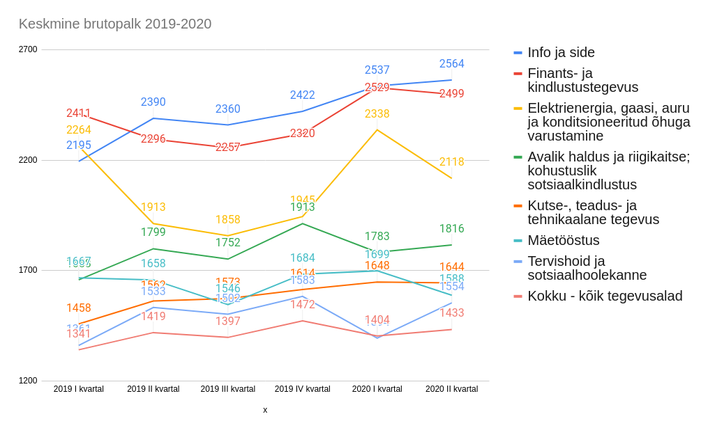

[drag=100 40, drop=top]

[drag=100 30, drop=0 50]
## Milleks õppida IT-d?

[drag=100 20, drop=0 80]
### Ago Luberg
#### Lektor

---

## IKT tööhõive

@div[left-50]

@ul
- IKT - Info- ja Kommunikatsiooni tehnoloogia
- OSKA - Oskuste arendamise koordinatsioonisüsteem
- Raport aastast 2016
@ulend
@divend

@div[right-50]

@divend

---

---?image=IKT-Palk-graafik.jpg&size=auto 100%

---?image=IKT-Noudlus.jpg&size=auto 100%

@div[right-50]
@ul[ul-overlay]
- Aastas vaja 1580 inimest
  - 1125 kõrgharidus
  - 455 kutseharidus
- Sisse astub 2600
- Lõpetab @css[text-red](1150)
  - @css[text-red](600 kõrgharidus)
  - @css[text-green](550 kutseharidus)

@ulend
@divend

---

### Katkestasmine IKT erialadel

@ul[text-06](false)
- bakalaureus, 2007-2014
- Allikas: Tudengite õpingute katkestamise põhjused IKT kõrghariduses (2015)
@ulend

---

### Katkestamise mõjud

@ul[text-06](false)
- bakalaureus, 2007-2014
- Allikas: Tudengite õpingute katkestamise põhjused IKT kõrghariduses (2015)
@ulend

---

# Miks võiks IT sobida?

---?image=ape-to-robot.jpg

---?image=work-abroad.jpg

---?image=different-domains.jpg

---?image=fitsme.jpg

---?image=iseauto-starship.jpg

---?image=offices.jpg

---?image=offices2020.jpg

---

[drag=100 10, drop=top]
## Keskmine brutopalk 2019-2020

---

# Ohud IT-s

---?image=it-stack.jpg

---?image=good-salary.jpg&size=auto 120%

---

## Kuidas aru saada, kas IT on mulle sobiv?

@ul[text-11]
- Kas sul on kirg tehnoloogia vastu?
- Kas sul on huvi saada teada, kuidas asjad töötavad?
- Kas sulle meeldib luua uusi huvitavaid asju?
  - näiteks mängud, mobla äpp
- Kas sulle meeldib uusi asju õppida?
- Kas sulle meeldib õppida ka veel 10-20 aasta pärast?
- Sulle meeldib automatiseerida?
- @css[text-green](**JAH**) - IT sobib sulle
@ulend

---

## Ohukohad

@ul[ul12]
- Rutiini vähesus - pidevalt peab uusi tehnoloogiaid õppima, ajaga kaasas käima
- Pidevalt tuleb õppida / areneda
- Tööaeg pole piiratud (oht töötada öösel)
- Programmeerimise puhul algoritmiline mõtlemine vajab harjumist
- Valid eriala seepärast, et kõik kiidavad/tehakse palju reklaami
  - Aga endal huvi selle vastu puudub
- Võib tunduda "ehitaja" tööna, kus realiseerid kellegi teise mõtteid
  - Ehk siis tundub, et pole piisavalt loov töö
@ulend

---

[drag=100 20, drop=0 0]
## Programmeerimine on "lihtne"

[drag=50 100, drop=0 20]
@ul
- Selline reklaam demotiveerib mõnda inimest
- Inimene proovib programmeerida, aga ei saa hakkama
  - Jääb mulje, et viga on temas
- Tegelikult sõltub "lihtsus" konkreetsest probleemist
- IT on rohkem kui programmeerimine
@ulend

---
[drag=100 20, drop=0 0]
## Keda tööandja otsib?
[drag=90 80, drop=10 20, set=align-left, fit=1.6]
@ul
- Motivatsioon
- Suhtlemisoskus
- Julgus küsida
- Õppimisvõime
- Aktiivsus
- Kohanemisvõime
- Inglise keele oskus
@ulend

---

## Soovitusi

@ul[text-13]
- Kui eelnevalt pole programmeerimisega tegelenud, siis tasuks enne ülikooli astumist (näiteks suvel) ennast ette valmistada
- Tase tudengitel on väga erinev
- Ülikoolis pigem on tempo kiire ning oht maha jääda
- Ole valmis iseseisvalt õppima (terve Internet on õppematerjale täis)
- Ole valmis küsima ja suhtlema
- Praktika on parem kui teooria
- Aga teooria on ka vajalik
@ulend

---

# aITäh!
